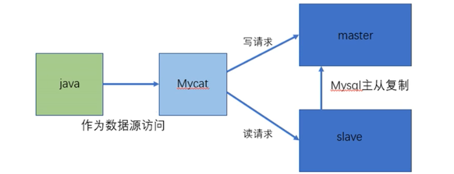
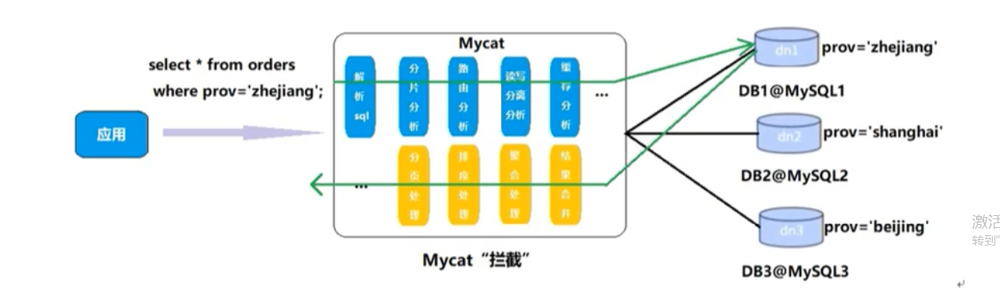

# MyCat

## 一 MyCat 简介

> - MyCat 官网 http://www.mycat.org.cn/
> - 数据库中间件
>   - 中间件是一类连接软件组件和应用的计算机软件
> - 数据库中间件的对比
>   - Cobar	阿里团队开发但已多年未维护更新
>   - MyCat	基于Cobar二次开发 开源社区维护
>   - OneProxy	不开源的商业中间件
>   - kingshard	go语言开发，在不断完善
>   - Vitess	Youtube生成在使用，不支持MySQL原生协议
>   - Atlas	360团队基于MySQLProxy改写，高并发下不稳定
>   - MaxScale	MaxScale是mariadb研发的中间件
>   - MySQLRoute	MySQLRoute是MySQL官方Oracle公司开发的中间件
> - java应用与数据库直接连接存在的问题
>   - Java与数据库紧耦合
>   - 高访问量高并发对数据库的压力
>   - 读写请求的数据不一致
> - java应用与数据库中引入MyCat
>   - 将数据库配置项托管给MyCat解决了数据库与Java的紧耦合问题
>   - 配置多个数据库进行负载均衡，解决了数据库的高访问高并发问题
>   - 配置主从数据库(从机会备份主机的内容)，主机负责写，从机负责读，解决了读写请求数据不一致的问题
> - MyCat 读写分离
> - MyCat 数据分片
>   - 垂直拆分(分库)
>   - 水平拆分(分表)
>   - 垂直+水平
>   - 
> - MyCat 多数据源整合
> - MyCat 原理
>   - 拦截所有的SQL语句，并做一些特定的分析(分片分析，路由拆分，读写分离分析，缓存分析等),然后将SQL发往后端的真实数据库，并将返回的结果做适当的处理，最后返回用户

## 二 MyCat 安装

### Ⅰ 安装并解压压缩包

```
// 下载
wget http://dl.mycat.org.cn/1.6.7.6/20210303094759/Mycat-server-1.6.7.6-release-20210303094759-linux.tar.gz
// 解压 
tar -vzxf Mycat-server-1.6.7.6-release-20210303094759-linux.tar.gz
```

### Ⅱ 常用配置文件

> - schema.xml      定义逻辑库,表,分片节点等内容
> - rule.xml     定义分片规则
> - server.xml      定义用户以及系统相关变量，如端口等

### Ⅲ 修改配置文件 完成读写分离配置

- server.xml (vi /usr/local/mycat/conf/server.xml)

  ```xml
   <user name="root" defaultAccount="true">
                  <property name="password">123456</property>
                  <property name="schemas">TESTDB</property>
                  <property name="defaultSchema">TESTDB</property>
                  <!--No MyCAT Database selected 错误前会尝试使用该schema作为schema，不设置则为null,报错 -->
  
                  <!-- 表级 DML 权限设置 -->
                  <!--
                  <privileges check="false">
                          <schema name="TESTDB" dml="0110" >
                                  <table name="tb01" dml="0000"></table>
                                  <table name="tb02" dml="1111"></table>
                          </schema>
                  </privileges>
                   -->
          </user>
  
  修改后
   <user name="mycat" defaultAccount="true">
                  <property name="password">123456</property>
                  <property name="schemas">TESTDB</property>
                  <property name="defaultSchema">TESTDB</property>
                  <!--No MyCAT Database selected 错误前会尝试使用该schema作为schema，不设置则为null,报错 -->
  
                  <!-- 表级 DML 权限设置 -->
                  <!--
                  <privileges check="false">
                          <schema name="TESTDB" dml="0110" >
                                  <table name="tb01" dml="0000"></table>
                                  <table name="tb02" dml="1111"></table>
                          </schema>
                  </privileges>
                   -->
          </user>
  ```

- schema.xml (vi /usr/local/mycat/conf/schema.xml)

  ```xml
  <?xml version="1.0"?>
  <!DOCTYPE mycat:schema SYSTEM "schema.dtd">
  <mycat:schema xmlns:mycat="http://io.mycat/">
  
  	<schema name="TESTDB" checkSQLschema="true" sqlMaxLimit="100" randomDataNode="dn1">
  		<!-- auto sharding by id (long) -->
  		<!--splitTableNames 启用<table name 属性使用逗号分割配置多个表,即多个表使用这个配置-->
  <!--fetchStoreNodeByJdbc 启用ER表使用JDBC方式获取DataNode-->
  		<table name="customer" primaryKey="id" dataNode="dn1,dn2" rule="sharding-by-intfile" autoIncrement="true" fetchStoreNodeByJdbc="true">
  			<childTable name="customer_addr" primaryKey="id" joinKey="customer_id" parentKey="id"> </childTable>
  		</table>
  		<!-- <table name="oc_call" primaryKey="ID" dataNode="dn1$0-743" rule="latest-month-calldate"
  			/> -->
  	</schema>
  	<!-- <dataNode name="dn1$0-743" dataHost="localhost1" database="db$0-743"
  		/> -->
  	<dataNode name="dn1" dataHost="localhost1" database="db1" />
  	<dataNode name="dn2" dataHost="localhost1" database="db2" />
  	<dataNode name="dn3" dataHost="localhost1" database="db3" />
  	<!--<dataNode name="dn4" dataHost="sequoiadb1" database="SAMPLE" />
  	 <dataNode name="jdbc_dn1" dataHost="jdbchost" database="db1" />
  	<dataNode	name="jdbc_dn2" dataHost="jdbchost" database="db2" />
  	<dataNode name="jdbc_dn3" 	dataHost="jdbchost" database="db3" /> -->
  	<dataHost name="localhost1" maxCon="1000" minCon="10" balance="0"
  			  writeType="0" dbType="mysql" dbDriver="jdbc" switchType="1"  slaveThreshold="100">
  		<heartbeat>select user()</heartbeat>
  		<!-- can have multi write hosts -->
  		<writeHost host="hostM1" url="jdbc:mysql://localhost:3306" user="root"
  				   password="root">
  		</writeHost>
  		<!-- <writeHost host="hostM2" url="localhost:3316" user="root" password="123456"/> -->
  	</dataHost>
  	<!--
  		<dataHost name="sequoiadb1" maxCon="1000" minCon="1" balance="0" dbType="sequoiadb" dbDriver="jdbc">
  		<heartbeat> 		</heartbeat>
  		 <writeHost host="hostM1" url="sequoiadb://1426587161.dbaas.sequoialab.net:11920/SAMPLE" user="jifeng" 	password="jifeng"></writeHost>
  		 </dataHost>
  
  	  <dataHost name="oracle1" maxCon="1000" minCon="1" balance="0" writeType="0" 	dbType="oracle" dbDriver="jdbc"> <heartbeat>select 1 from dual</heartbeat>
  		<connectionInitSql>alter session set nls_date_format='yyyy-mm-dd hh24:mi:ss'</connectionInitSql>
  		<writeHost host="hostM1" url="jdbc:oracle:thin:@127.0.0.1:1521:nange" user="base" 	password="123456" > </writeHost> </dataHost>
  
  		<dataHost name="jdbchost" maxCon="1000" 	minCon="1" balance="0" writeType="0" dbType="mongodb" dbDriver="jdbc">
  		<heartbeat>select 	user()</heartbeat>
  		<writeHost host="hostM" url="mongodb://192.168.0.99/test" user="admin" password="123456" ></writeHost> </dataHost>
  
  		<dataHost name="sparksql" maxCon="1000" minCon="1" balance="0" dbType="spark" dbDriver="jdbc">
  		<heartbeat> </heartbeat>
  		 <writeHost host="hostM1" url="jdbc:hive2://feng01:10000" user="jifeng" 	password="jifeng"></writeHost> </dataHost> -->
  
  	<!-- <dataHost name="jdbchost" maxCon="1000" minCon="10" balance="0" dbType="mysql"
  		dbDriver="jdbc"> <heartbeat>select user()</heartbeat> <writeHost host="hostM1"
  		url="jdbc:mysql://localhost:3306" user="root" password="123456"> </writeHost>
  		</dataHost> -->
  </mycat:schema>
  
  修改后
  
  <?xml version="1.0"?>
  <!DOCTYPE mycat:schema SYSTEM "schema.dtd">
  <mycat:schema xmlns:mycat="http://io.mycat/">
  	<!-- 逻辑库 randomDataNode指逻辑库的数据节点 -->
  	<schema name="TESTDB" checkSQLschema="false" sqlMaxLimit="100" dataNode="dn1">
  	</schema>
  	<!-- 数据节点 -->
  	<dataNode name="dn1" dataHost="host1" database="testdb"/>
  	<!-- 数据主机 -->
      <!--
  		balance="0":不开启读写分离,所有读操作都发送到当前可用的writeHost上
  		balance="1":全部的readHost与stand by writeHost参与select语句的负载均衡，简单来说当双主双从模式(M1-》S1，M2-》S2 且M1-》M2互为主备)，正常情况下,M2,S1,S2都参与select语句的负载均衡
  		balance="2":所有的读操作都随机的在writeHost和readHost上分发
  		balance="3":所有的读写请求随机的分发到readHost执行，writeHost不负担读压力
  	-->
  	<dataHost name="host1" maxCon="1000" minCon="10" balance="0" writeType="0" dbType="mysql" dbDriver="native" switchType="1"  slaveThreshold="100">
  		<!-- 心跳检测 -->
  		<heartbeat>select user()</heartbeat>
  		<!-- can have multi write hosts -->
  		<!-- 负责写入的主机 -->
  		<writeHost host="hostM1" url="192.168.80.141:3306" user="root" password="123456">
  			<!-- 负责读取的从机 -->
  			<readHost host="hostS1" url="192.168.80.140:3306" user="root" password="123456"/>
  		</writeHost>
  	</dataHost>
  </mycat:schema>
  
  
  <?xml version="1.0"?>
  <!DOCTYPE mycat:schema SYSTEM "schema.dtd">
  <mycat:schema xmlns:mycat="http://io.mycat/">
  	<schema name="TESTDB" checkSQLschema="false" sqlMaxLimit="100" dataNode="dn1">
  	</schema>
  	<dataNode name="dn1" dataHost="host1" database="testdb"/>
  	<dataHost name="host1" maxCon="1000" minCon="10" balance="0" writeType="0" dbType="mysql" dbDriver="native" switchType="1"  slaveThreshold="100">
  		<heartbeat>select user()</heartbeat>
  		<writeHost host="hostM1" url="192.168.80.143:3306" user="root" password="123456">
  			<readHost host="hostS1" url="192.168.80.144:3306" user="root" password="123456"/>
  		</writeHost>
  	</dataHost>
  </mycat:schema>
  ```

### Ⅳ 启动mycat

```
// bin目录下直接启动
./mycat start

//后台启动
./mycat console
```

### Ⅴ 安装mysql80(cenosX 就选elX)

> - 安装过程中如出现Another app is currently holding the yum lock; waiting for it to exit...的错误，可能是系统自动升级正在运行，因此执行下面语句用于释放yum进程
>
>   ```
>   rm -f /var/run/yum.pid
>   ```
>
> - 卸载默认的mariadb
>
>   ```
>   // 查看已安装的sql
>   yum search mysql
>   // 删除mariadb
>   yum remove mariadb.x86_64
>   ```
>
> - 下载rpm包 也可以在win系统下下载再传到Linux上
>
>   ```
>   wget https://dev.mysql.com/get/mysql80-community-release-el7-3.noarch.rpm
>   ```
>
> - 安装rpm文件
>
>   ```
>   yum localinstall mysql80-community-release-el7-3.noarch.rpm
>   ```
>
> - 检查是否安装成功
>
>   ```
>   yum search mysql
>   ```
>
> - 安装mysql
>
>   ```
>   yum install mysql-community-server.x86_64
>   ```
>
> - 启动mysql
>
>   ```
>   systemctl start mysqld.service
>   ```
>
> - 查看是否启动
>
>   ```
>   ps -ef | grep mysql
>   ```
>
> - 进入配置文件
>
>   ```
>   vim /etc/my.cnf
>   ```
>
> - 加入登入跳过权限检查
>
>   ```
>   skip-grant-tables
>   ```
>
> - 重启mysql
>
>   ```
>   systemctl restart mysqld.service
>   ```
>
> - 进入mysql
>
>   ```
>   mysql
>   ```
>
> - 设置密码
>
>   ```mysql
>   #切换数据库
>   use mysql
>   #设置密码
>   ALTER USER 'root'@'localhost' IDENTIFIED WITH mysql_native_password BY '123456';
>   ```
>
> - 如果出现The MySQL server is running with the --skip-grant-tables option so it cannot execute this statement则执行
>
>   ```mysql
>   flush privileges;
>   ```
>
> - 如果出现ERROR 1819 (HY000): Your password does not satisfy the current policy requirements则执行
>
>   ```mysql
>   // 查看权限
>   SHOW VARIABLES LIKE 'validate_password%';
>   #validate_password_dictionary_file
>   #插件用于验证密码强度的字典文件路径。
>   
>   #validate_password_length
>   #密码最小长度，参数默认为8，它有最小值的限制，最小值为：
>   #validate_password_number_count +validate_password_special_char_count + (2 *validate_password_mixed_case_count)
>   
>   #validate_password_mixed_case_count
>   #密码至少要包含的小写字母个数和大写字母个数。
>   
>   #validate_password_number_count
>   #密码至少要包含的数字个数。
>   
>   #validate_password_policy
>   #密码强度检查等级，0/LOW、1/MEDIUM、2/STRONG。
>   #validate_password_special_char_count
>   #密码至少要包含的特殊字符数。
>   // 修改权限
>   // 修改密码长度
>   set global validate_password.length=6;
>   // 修改密码规则
>   set global validate_password.policy=0;
>   
>   set global validate_password.length=6;
>   set global validate_password.policy=0;·
>   ```
>
>
> - 进入配置文件注释登入跳过权限检查
>
>   ```
>   vi /etc/my.cnf
>   ```
>
> - 重启服务器
>
>   ```
>   systemctl restart mysqld.service
>   ```
>
> - 测试是否可以登入(-p后面不建议直接输入密码)
>
>   ```mysql
>   mysql -uroot -p123456
>   ```
>
> - 添加远程连接用户
>
>   ```mysql
>   # 设置用户
>   create user 'visitor'@'192.168.80.142' identified by '123456';
>   # 刷新权限
>   flush privileges; 
>   ```
>
> - 修改用户密码
>
>   ```mysql
>    # 切库
>    use mysql
>    #　查看用户
>    select user, host from mysql.user;
>    #　删除用户
>    delete from mysql.user where user = '据表的user而定' and host = '据表的localhost而定';
>    # 重新创建用户
>    create user '用户名'@'用户IP地址' identified by '密码';
>   ```

## 三 Mycat的使用

### Ⅰ一主一从

> - 主机从机开放对应窗口
>
>   ```
>   开启端口
>   firewall-cmd --zone=public --add-port=(需要开发的端口)/tcp --permanent
>   开放端口后需重启防火墙
>   systemctl reload firewalld
>   ```
>
> - 进入my.cnf文件　
>
>   ```
>   vi /etc/my.cnf
>   ```
>
> - 向配置文件中添加
>
>   ```cnf
>   主机配置
>   # 主服务器唯一ID
>   server-id=1
>   # 启用二进制日志
>   log-bin=mysql-bin
>   # 设置不需要复制的数据库
>   binlog-ignore-db=mysql
>   binlog-ignore-db=information_schema
>   # 设置需要复制的服务器
>   binlog-do-db=testdb
>   # 设置logbin格式
>   binlog_format=STATEMENT
>   
>   从机配置
>   server-id=2
>   relay-log=mysql-relay
>   ```
>
> - 重启mysql
>
>   ```
>   systemctl restart  mysqld.service
>   ```
>
> - 在主机为从机创建访问的账户
>
>   ```mysql
>   # 切库
>   use mysql
>   // 创建对象
>   create user 'slave'@'%' identified by '123456';
>   // 如出现Operation CREATE USER failed for 'slave'@'%'的情况，则删除用户
>   drop user 'slave'@'%';
>   
>   //　查看用户
>   select user, host from mysql.user;
>   // 赋予权限
>   GRANT REPLICATION SLAVE ON *.* TO '据表的user而定'@'据表的localhost而定';
>   GRANT REPLICATION SLAVE ON *.* TO 'slave'@'%';
>   // 赋予最高权限
>   grant all privileges on *.* to 'root'@'%'
>   ```
>
> - 在主机查看从机配置的修改信息
>
>   ```
>   show master status;
>   ```
>
>   
>
> - 绑定连接信息
>
>   ```mysql
>   change master to master_host='192.168.80.14'(主机IP),
>   master_user='slave'(账户名称),
>   master_password='123456'(账户密码),
>   master_log_file='mysql-bin.000001'(对应主机show master status的相关信息),
>   master_log_pos=438(对应主机show master status的相关信息);
>   
>   change master to master_host='192.168.80.141',
>   master_user='slave',
>   master_password='123456',
>   master_log_file='mysql-bin.000002',
>   master_log_pos=156;
>   
>   // 如果出现 Authentication plugin 'caching_sha2_password' reported error: Authentication requires secure connection.的错误
>   // 停止复制
>   stop slave;
>   // 重置 
>   reset master;
>   // 设置解码规则
>   change master to master_auto_position=0;
>   change master to get_master_public_key=1;
>   ```
>
> - 启动连接
>
>   ```mysql
>   start slave;
>   ```
>
> - 查看连接信息
>
>   ```mysql
>   show slave status\G
>   ```
>
>   
>
> - 测试：创建数据库及表并添加数据 若从机主机数据一致则代表成功
>
>   ```mysql
>   // 主机
>   // 创建数据库
>   create database testdb;
>   // 切换至对应数据库
>   use testdb;
>   // 建表
>   create table mytbl(id int,name varchar(20));
>   // 添加数据
>   insert into mytbl value(1,"zhangsan");
>   // 查看数据
>   select * from mytbl;
>   
>   // 从机
>   // 切换数据库
>   use testdb;
>   // 查看数据
>   select * from mytbl;
>   ```
>
>
> - 读写分离查看主从hostname是否相同
>
>   ```
>   // 查看主从机的hostname 如果相同就修改，修改完后需要重启主从
>   vi /etc/hostname
>   ```
>
> - 添加测试数据
>
>   ```mysql
>   // 主机
>   // 切换至对应数据库
>   use testdb;
>   // 添加数据 确保hostname是不同的
>   insert into mytbl value(1,@@hostname);
>   // 如果出现Data too long for column 'name' at row 1
>   // 修改类型长度 
>   alter table mytbl  modify column name char(200);
>   // 查看数据
>   select * from mytbl;
>   
>   // 从机
>   // 切换至对应数据库
>   use testdb;
>   // 查看数据 确保双方数据不一致
>   select * from mytbl;
>   ```
>
> - 修改配置文件
>
>   ```xml
>    // server.xml
>    <user name="mycat" defaultAccount="true">
>                   <property name="password">123456</property>
>                   <property name="schemas">TESTDB</property>
>                   <property name="defaultSchema">TESTDB</property>
>                   <!--No MyCAT Database selected 错误前会尝试使用该schema作为schema，不设置则为null,报错 -->
>   
>                   <!-- 表级 DML 权限设置 -->
>                   <!--
>                   <privileges check="false">
>                           <schema name="TESTDB" dml="0110" >
>                                   <table name="tb01" dml="0000"></table>
>                                   <table name="tb02" dml="1111"></table>
>                           </schema>
>                   </privileges>
>                    -->
>           </user>
>   
>   // schema.xml
>     <?xml version="1.0"?>
>   
>      <!DOCTYPE mycat:schema SYSTEM "schema.dtd">
>      <mycat:schema xmlns:mycat="http://io.mycat/">
>      <schema name="TESTDB" checkSQLschema="false" sqlMaxLimit="100" dataNode="dn1">
>      	</schema>
>      	<dataNode name="dn1" dataHost="host1" database="testdb"/>
>      	<dataHost name="host1" maxCon="1000" minCon="10" balance="3" writeType="0" dbType="mysql" dbDriver="native" switchType="1"  slaveThreshold="100">
>      		<heartbeat>select user()</heartbeat>
>      		<writeHost host="hostM1" url="192.168.80.143:3306" user="root" password="123456">
>      			<readHost host="hostS1" url="192.168.80.144:3306" user="root" password="123456"/>
>      		</writeHost>
>      	</dataHost>
>      </mycat:schema>
>   ///
>   ```
>
> - 重启mycat
>
>   ```
>   ./mycat console
>   ```
>
> - 开放writehost和readhost权限
>
>   ```
>   # 切库
>   use mysql
>   // 创建对象
>   create user 'root'@'%' identified by '123456';
>   // 赋予最高权限
>   grant all privileges on *.* to 'root'@'%'
>   ```
>
> - 登入mycat
>
>   ```
>   mysql -umycat -p123456 -h192.168.80.143 -P8066
>   
>   // 如果出现 Access denied for user 'mycat', because password is error的问题
>   mysql -umycat -p123456 -h192.168.80.143 -P8066 --default-auth=mysql_native_password
>   ```
>
> - 切至逻辑库
>
>   ```
>   // 如果在测试过程中出现了卡顿不流畅且查询数据库时出现Invalid DataSource:0，需检查对应的writehost和readhost权限是否开启或防火墙是否开启端口
>   // 切换至逻辑库
>   use TESTDB
>   ```
>
> - 如果出现Client does not support authentication protocol requested by server; consider upgrading MySQL client是因为密码的加密问题需要修改writehost和readhost的密码
>
>   ```
>   // 修改密码并且切换加密方式
>    ALTER USER 'root'@'%' IDENTIFIED WITH mysql_native_password BY '123456';
>   // 刷新配置
>   FLUSH PRIVILEGES;
>   ```
>
> - 测试是否读写分离
>
>   ```mysql
>    // 查询数据
>   select * from mytbl;
>   ```

### Ⅱ 二主二从

- 关闭防火墙

  ```
  systemctl stop firewalld
  ```

- 停止主从关系

  ```mysql
  stop slave;
  reset master;
  ```

- 修改配置文件my.cnf

  ```conf
  #master
  # 主服务器唯一ID
  server-id=1
  # 启动二进制日志
  log-bin=mysql-bin
  # 设置不需要复制的数据库(可设置多个)
  binlog-ignore-db=mysql
  binlog-ignore-db=information-schema
  # 设置需要复制的主数据库名称
  binlog-do-db=需要复制的主数据库名称
  #设置logbin的格式
  binlog_format=STATEMENT
  # 作为从数据库时有写入操作也更新二进制日志文件
  log-slave-updates
  # 表示自增长字段每次递增的量，指自增字段的起始值，其默认值为1，取值范围为1-65535
  auto-increment-increment=2
  # 表示自增字段从那个数开始，指字段一次递增多少，取值范围为1-65535
  auto-increment-offset=1
  
  #slave
  # 从服务器唯一Id
  server-id=1
  # 中继日志
  relay-log=mysql-relay
  
  
  #master 1
  server-id=1
  log-bin=mysql-bin
  binlog-ignore-db=mysql
  binlog-ignore-db=information-schema
  binlog-do-db=testdb
  binlog_format=STATEMENT
  log-slave-updates
  auto-increment-increment=2
  auto-increment-offset=1
  
  #master 2
  server-id=3
  log-bin=mysql-bin
  binlog-ignore-db=mysql
  binlog-ignore-db=information-schema
  binlog-do-db=testdb
  binlog_format=STATEMENT
  log-slave-updates
  auto-increment-increment=2
  auto-increment-offset=2
  
  #slave1
  server-id=2
  relay-log=mysql-relay
  
  #slave2
  server-id=4
  relay-log=mysql-relay
  ```

- 重启mysql

  ```
  systemctl restart mysqld.service
  ```

- 查看权限slave是否开启

  ```
  select host,user from user;
  
  // 没有则创建
  create user 'slave'@'%' identified by '123456';
  GRANT REPLICATION SLAVE ON *.* TO 'slave'@'%';
  ```

- 查看主机相关绑定信息

  ```
  show master status;
  ```

- 从机绑定主机信息和主机互邦

  ```
  change master to master_host='192.168.80.143',
  master_user='slave',
  master_password='123456',
  master_log_file='mysql-bin.000002',
  master_log_pos=156;
  ```

- 启动连接

  ```
  start slave;
  ```

- 查看连接信息

  ```
  show slave status\G
  ```

- 添加测试

  ```
  // 在master1上创建
  create database testdb;
  // 若已创建过则删除
  drop database testdb;
  // 查看数据库
  show databases;
  // 切库
  use testdb;
  // 创建数据库表
  create table mytbl(id int,name varchar(200));
  // 创建测试数据
  insert into mytbl values(1,'zhangsan');
  // 在所有服务器上查看数据
  select * from mytbl;
  ```

- 配置mycat配置文件schema.xml

  ```
  <?xml version="1.0"?>
  <!DOCTYPE mycat:schema SYSTEM "schema.dtd">
  <mycat:schema xmlns:mycat="http://io.mycat/">
          <schema name="TESTDB" checkSQLschema="false" sqlMaxLimit="100" dataNode="dn1">
          </schema>
          <dataNode name="dn1" dataHost="host1" database="testdb"/>
          <dataHost name="host1" maxCon="1000" minCon="10" balance="1" writeType="0" dbType="mysql" dbDriver="native" switchType="1"  slaveThreshold="100">
                  <heartbeat>select user()</heartbeat>
                  <writeHost host="hostM1" url="192.168.80.141:3306" user="root" password="123456">
                          <readHost host="hostS1" url="192.168.80.140:3306" user="root" password="123456"/>
                  </writeHost>
                  <writeHost host="hostM2" url="192.168.80.143:3306" user="root" password="123456">
                          <readHost host="hostS2" url="192.168.80.144:3306" user="root" password="123456"/>
                  </writeHost>
          </dataHost>
  </mycat:schema>
  ```

- 启动mycat并查询数据

  ```
  // bin目录下直接启动
  ./mycat start
  
  //后台启动
  ./mycat console
  
  // 登入mycat
  mysql -umycat -p123456 -h192.168.80.143 -P8066 --default-auth=mysql_native_password
  
  // 查看数据
  use TESTDB;
  select * from mytbl;
  ```


### Ⅲ 垂直分库

- 垂直分库的意义: 将毫无关联的数据库表分开，已达到减缓数据库查询的压力,但仅限于在新库上使用

- **实现垂直分表:**修改schema.xml配置文件

  ```
  <?xml version="1.0"?>
  <!DOCTYPE mycat:schema SYSTEM "schema.dtd">
  <mycat:schema xmlns:mycat="http://io.mycat/">
          <schema name="TESTDB" checkSQLschema="false" sqlMaxLimit="100" dataNode="dn1">
          	<table name='需要分库的表' dataNode='负责接收的库'></table>
          </schema>
          <dataNode name="dn1" dataHost="host1" database="orders"/>
          <dataNode name="dn2" dataHost="host2" database="orders"/>
          <dataHost name="host1" maxCon="1000" minCon="10" balance="0" writeType="0" dbType="mysql" dbDriver="native" switchType="1"  slaveThreshold="100">
                  <heartbeat>select user()</heartbeat>
                  <writeHost host="hostM1" url="192.168.80.141:3306" user="root" password="123456">
                  </writeHost>
          </dataHost>
          <dataHost name="host2" maxCon="1000" minCon="10" balance="0" writeType="0" dbType="mysql" dbDriver="native" switchType="1"  slaveThreshold="100">
                  <heartbeat>select user()</heartbeat>
                  <writeHost host="hostM1" url="192.168.80.140:3306" user="root" password="123456">
                  </writeHost>
          </dataHost>
  </mycat:schema>
  ```

- **实现垂直分表:**在两个数据库中创建新的空白库orders(对应dataNode的database)

  ```
  在创建的表前要清除所有关联
  stop slave;
  reset master;
  
  create database orders;
  ```

- **实现垂直分表:**启动mycat(当mycat的bin)

  ```
  ./mycat console
  ```

- **实现垂直分表:**创建测试数据

  ```
  # 登入
  mysql -umycat -p123456 -h192.168.80.143 -P8066 --default-auth=mysql_native_password
  # 创建customer
  create table customer(id int auto_increment,name varchar(200),primary key(id));
  # 创建orders
  create table orders(id int auto_increment,order_type int,customer_id int,amount decimal(10,2),primary key(id));
  # 创建orders_detail
  create table orders_detail(id int auto_increment,detail varchar(2000),order_id int,primary key(id));
  # 创建状态字典表
  create table dict_order_type(id int auto_increment,order_type varchar(200),primary key(id));
  
  # 查看mycat上是否创建
  show tables
  
  # 切换至不同主机查看若结果不同则成功(customer与其他表存于不同的数据库)
  use orders;
  show tables;
  ```


### Ⅳ 水平分表

- 水平分表的意义：当数据库数据达1000w条数据时将达到瓶颈，因而影响查询效率，需使用水平分表去进行优化

- 使用的分片规则为取模，对分片字段进行求模运算来均衡分配

- **实现水平分表:**修改schema.xml配置文件

  ```
  
  <?xml version="1.0"?>
  <!DOCTYPE mycat:schema SYSTEM "schema.dtd">
  <mycat:schema xmlns:mycat="http://io.mycat/">
          <schema name="TESTDB" checkSQLschema="false" sqlMaxLimit="100" dataNode="dn1">
          	<table name='需要分库的表' dataNode='负责接收的库'></table>
          	<table name='需要分表的库' dataNode='负责接收的库' rule='自定义分片规则字段'></table>
          </schema>
          <dataNode name="dn1" dataHost="host1" database="orders"/>
          <dataNode name="dn2" dataHost="host2" database="orders"/>
          <dataHost name="host1" maxCon="1000" minCon="10" balance="0" writeType="0" dbType="mysql" dbDriver="native" switchType="1"  slaveThreshold="100">
                  <heartbeat>select user()</heartbeat>
                  <writeHost host="hostM1" url="192.168.80.141:3306" user="root" password="123456">
                  </writeHost>
          </dataHost>
          <dataHost name="host2" maxCon="1000" minCon="10" balance="0" writeType="0" dbType="mysql" dbDriver="native" switchType="1"  slaveThreshold="100">
                  <heartbeat>select user()</heartbeat>
                  <writeHost host="hostM1" url="192.168.80.140:3306" user="root" password="123456">
                  </writeHost>
          </dataHost>
  </mycat:schema>
  
  ```

- **实现水平分表:**修改配置文件rul.xml

  ```
  # 添加一行
  <tableRule name="mod_rule">
  	<rule>
  		<columns>customer_id</columns>
  		<algorithm>mod-long</algorithm>
  	</rule>
  </tableRule>
  
  #修改配置文件中的mod-long
  <function name="mod-long" class="io.mycat.route.function.PartitionByMod">
                  <!-- how many data nodes -->
                  <property name="count">2</property>
  </function>
  ```

- **实现水平分表:**为dn2创建orders表

  ```
  create table orders(id int auto_increment,order_type int,customer_id int,amount decimal(10,2),primary key(id));
  ```

- **实现水平分表:**启动mycat(在bin目录下)

  ```
  ./mycat console
  // 登入mycat的sql
  mysql -umycat -p123456 -hIP地址 -P8066 --default-auth=mysql_native_password
  ```

- **实现水平分表:**添加测试数据

  ```
  // 切库
  use TESTDB
  // 添加数据
  insert into orders(id,order_type,customer_id,amount) values (101,101,140,110100);
  insert into orders(id,order_type,customer_id,amount) values (102,101,140,110100);
  insert into orders(id,order_type,customer_id,amount) values (103,101,140,110100);
  insert into orders(id,order_type,customer_id,amount) values (105,101,140,110100);
  ```

- **实现水平分表:**查询数据(如果一次性插入多条数据时查询出来的结果是乱序的则代表成功)

  ```
  select * from orders;
  ```

#### Ⅳ - Ⅰ ER表的实现

- 在借鉴了FoundationDB的设计思路后，提出了基于E-R关系的数据分片策略，子表的记录与所关联的父表记录存放在同一个数据分片上

- **实现垂ER表:**修改配置文件

  ```
  
  <?xml version="1.0"?>
  <!DOCTYPE mycat:schema SYSTEM "schema.dtd">
  <mycat:schema xmlns:mycat="http://io.mycat/">
          <schema name="TESTDB" checkSQLschema="false" sqlMaxLimit="100" dataNode="dn1">
          	<table name='需要分库的表' dataNode='数据节点'></table>
          	<table name='需要分表的库' dataNode='数据节点' rule='自定义分片规则字段'>
  		<childTable name='需要join查询的表' primaryKey='逻辑表的主键' joinKey='查找父表存储的数据节点' parentKey='真实表的主键'/>
  	</table>
          </schema>
          <dataNode name="dn1" dataHost="host1" database="orders"/>
          <dataNode name="dn2" dataHost="host2" database="orders"/>
          <dataHost name="host1" maxCon="1000" minCon="10" balance="0" writeType="0" dbType="mysql" dbDriver="native" switchType="1"  slaveThreshold="100">
                  <heartbeat>select user()</heartbeat>
                  <writeHost host="hostM1" url="192.168.80.141:3306" user="root" password="123456">
                  </writeHost>
          </dataHost>
          <dataHost name="host2" maxCon="1000" minCon="10" balance="0" writeType="0" dbType="mysql" dbDriver="native" switchType="1"  slaveThreshold="100">
                  <heartbeat>select user()</heartbeat>
                  <writeHost host="hostM1" url="192.168.80.140:3306" user="root" password="123456">
                  </writeHost>
          </dataHost>
  </mycat:schema>
  
  ```

- **实现ER表:**创建dn2的orders_detail表

  ```
  create table orders_detail(id int auto_increment,detail varchar(2000),order_id int,primary key(id));
  ```

- **实现ER表:**添加数据(添加的order_id需与orders表的一致)

  ```
  # 登入
  mysql -umycat -p123456 -h192.168.80.143 -P8066 --default-auth=mysql_native_password
  // 切库
  use TESTDB
  // 添加数据
  insert into orders_detail(id,detail,order_id) values (17,'detail1',17);
  insert into orders_detail(id,detail,order_id) values (18,'detail1',18);
  insert into orders_detail(id,detail,order_id) values (19,'detail1',19);
  insert into orders_detail(id,detail,order_id) values (20,'detail1',20);
  insert into orders_detail(id,detail,order_id) values (21,'detail1',21);
  insert into orders_detail(id,detail,order_id) values (22,'detail1',22);
  ```

- **实现ER表:**join查询

  ```
  select o.*,od.detail from orders o inner join orders_detail od on o.id=od.order_id;
  ```

  

#### Ⅳ - Ⅱ 全局表

- 全局表出现的原因

  1. 数据变动不频繁
  2. 数据量总体变化不大
  3. 数据规模不大，很少超过数十万条记录

- 全局表的特点

  1. 全局表的插入,更新操作会实时在所有节点上执行，保持在各个分片的数据一致性
  2. 全局表的查询操作，只从一个节点获取
  3. 全局表可以跟任何一个表进行Join操作

- **实现全局表:**配置schema.xml

  ```
  <?xml version="1.0"?>
  <!DOCTYPE mycat:schema SYSTEM "schema.dtd">
  <mycat:schema xmlns:mycat="http://io.mycat/">
          <schema name="TESTDB" checkSQLschema="false" sqlMaxLimit="100" dataNode="dn1">
  			<table name='需要分库的表' dataNode='数据节点'></table>
          	<table name='需要分表的库' dataNode='数据节点' rule='自定义分片规则字段'>
  				<childTable name='需要join查询的表' primaryKey='逻辑表的主键' joinKey='查找父表存储的数据节点' parentKey='真实表的主键'/>
  			</table>
              <table name='全局表的名称' dataNode='数据节点' type='类型(global全局)'></table>
          </schema>
          <dataNode name="dn1" dataHost="host1" database="orders"/>
          <dataNode name="dn2" dataHost="host2" database="orders"/>
          <dataHost name="host1" maxCon="1000" minCon="10" balance="0" writeType="0" dbType="mysql" dbDriver="native" switchType="1"  slaveThreshold="100">
                  <heartbeat>select user()</heartbeat>
                  <writeHost host="hostM1" url="192.168.80.141:3306" user="root" password="123456">
                  </writeHost>
          </dataHost>
          <dataHost name="host2" maxCon="1000" minCon="10" balance="0" writeType="0" dbType="mysql" dbDriver="native" switchType="1"  slaveThreshold="100">
                  <heartbeat>select user()</heartbeat>
                  <writeHost host="hostM1" url="192.168.80.140:3306" user="root" password="123456">
                  </writeHost>
          </dataHost>
  </mycat:schema>         
  ```
  
- **实现全局表:**为dn2创建全局表

  ```
  create table dict_order_type(id int auto_increment,order_type varchar(200),primary key(id));
  ```

- **实现全局表:**添加数据

  ```
  # 登入
  mysql -umycat -p123456 -h192.168.80.143 -P8066 --default-auth=mysql_native_password
  # 添加数据
  insert into dict_order_type(id,order_type) values (102,'typer2');
  insert into dict_order_type(id,order_type) values (101,'typer1');
  ```

- 查询dn1，dn2上是否存在

  ```
  select * from dict_order_type;
  ```


#### Ⅳ - Ⅲ 分片规则:分片枚举

- 通过配置文件中配置的可能枚举id，自己配置分片，已完成特定场合使用，如按规则存区域数据

- **实现分片枚举:**配置schema.xml文件

  ```
  <?xml version="1.0"?>
  <!DOCTYPE mycat:schema SYSTEM "schema.dtd">
  <mycat:schema xmlns:mycat="http://io.mycat/">
          <schema name="TESTDB" checkSQLschema="false" sqlMaxLimit="100" dataNode="dn1">
  			<table name='需要分库的表' dataNode='数据节点'></table>
          	<table name='需要分表的库' dataNode='数据节点' rule='自定义分片规则名称'>
  				<childTable name='需要join查询的表' primaryKey='逻辑表的主键' joinKey='查找父表存储的数据节点' parentKey='真实表的主键'/>
  			</table>
              <table name='全局表的名称' dataNode='数据节点' type='类型(global全局)'></table>
              <table name='枚举分片的数据库名称' dataNode='数据节点' rule='自定义分片规则名称'></table>
          </schema>
          <dataNode name="dn1" dataHost="host1" database="orders"/>
          <dataNode name="dn2" dataHost="host2" database="orders"/>
          <dataHost name="host1" maxCon="1000" minCon="10" balance="0" writeType="0" dbType="mysql" dbDriver="native" switchType="1"  slaveThreshold="100">
                  <heartbeat>select user()</heartbeat>
                  <writeHost host="hostM1" url="192.168.80.141:3306" user="root" password="123456">
                  </writeHost>
          </dataHost>
          <dataHost name="host2" maxCon="1000" minCon="10" balance="0" writeType="0" dbType="mysql" dbDriver="native" switchType="1"  slaveThreshold="100">
                  <heartbeat>select user()</heartbeat>
                  <writeHost host="hostM1" url="192.168.80.140:3306" user="root" password="123456">
                  </writeHost>
          </dataHost>
  </mycat:schema>         
  ```

- **实现分片枚举:**配置rule.xml文件

  ```
  <tableRule name="sharding_by_intfile">
                  <rule>
                          <columns>areacode(据该列进行分片)</columns>
                          <algorithm>hash-int(分片算法)</algorithm>
                  </rule>
  </tableRule>
     
   # 分片算法
  <function name="hash-int" class="io.mycat.route.function.PartitionByFileMap">
                  <property name="mapFile">partition-hash-int.txt</property>
                  <property name="type">1</property>
                  <property name="defaultNode">0</property>
          </function>
  
  # colums 分片字段
  # algorithm 分片函数
  # mapFile 标识配置文件名称
  # tpye 0为int类型 非0为String
  # defaultNode 默认节点 
  			  小于0表示不设置默认节点 
  			  大于等于0表示设置默认节点，设置默认节点如果碰到不认识的枚举值，就让他路由到默认节点，如不设置不识别就不报错
  ```

- **实现分片枚举:** 配置partition-hash-int.txt文件

  ```
  vi partition-hash-int.txt
  
  // 添加数据
  101=0
  102=1
  ```

- **实现分片枚举:** 创建区域表

  ```
  create table orders_ware_info (
  id int auto_increment comment '编码',
  order_id int comment '订单编号',
  address varchar(200) comment '地址',
  areacode varchar(20) comment '区域编号',
  primary key(id)
  );
  ```

- **实现分片枚举:**添加数据(由于mycat建表会大写所以表名需要大写)

  ```
  insert into ORDERS_WARE_INFO(id,order_id,address,areacode) values (1,1,'北京','101');
  insert into ORDERS_WARE_INFO(id,order_id,address,areacode) values (2,2,'天津','102');
  ```

- **实现分片枚举:**dn1，dn2查询结果(如果101在dn1，102在dn2则成功)

  ```
  select * from ORDERS_WARE_INFO;
  ```


#### Ⅳ - Ⅳ 分片规则:范围约定

- 适用于提前规划好的分片字段某个范围属于那个分片

- **实现分片的范围规定:** 修改配置schema.xml文件

  ```
  <?xml version="1.0"?>
  <!DOCTYPE mycat:schema SYSTEM "schema.dtd">
  <mycat:schema xmlns:mycat="http://io.mycat/">
          <schema name="TESTDB" checkSQLschema="false" sqlMaxLimit="100" dataNode="dn1">
  			<table name='需要分库的表' dataNode='数据节点'></table>
          	<table name='需要分表的库' dataNode='数据节点' rule='自定义分片规则名称'>
  				<childTable name='需要join查询的表' primaryKey='逻辑表的主键' joinKey='查找父表存储的数据节点' parentKey='真实表的主键'/>
  			</table>
              <table name='全局表的名称' dataNode='数据节点' type='类型(global全局)'></table>
              <table name='枚举分片的数据库名称' dataNode='数据节点' rule='自定义分片规则名称'></table>
              <table name='范围枚举的数据库名称' dataNode='数据节点' rule='自定义分片规则名称'></table>
          </schema>
          <dataNode name="dn1" dataHost="host1" database="orders"/>
          <dataNode name="dn2" dataHost="host2" database="orders"/>
          <dataHost name="host1" maxCon="1000" minCon="10" balance="0" writeType="0" dbType="mysql" dbDriver="native" switchType="1"  slaveThreshold="100">
                  <heartbeat>select user()</heartbeat>
                  <writeHost host="hostM1" url="192.168.80.141:3306" user="root" password="123456">
                  </writeHost>
          </dataHost>
          <dataHost name="host2" maxCon="1000" minCon="10" balance="0" writeType="0" dbType="mysql" dbDriver="native" switchType="1"  slaveThreshold="100">
                  <heartbeat>select user()</heartbeat>
                  <writeHost host="hostM1" url="192.168.80.140:3306" user="root" password="123456">
                  </writeHost>
          </dataHost>
  </mycat:schema>         
  ```

- **实现分片的范围规定:** 配置rule.xml文件

  ```
  <tableRule name="auto_sharding_long">
        <rule>
            <columns>order_id</columns>
            <algorithm>rang-long</algorithm>
         </rule>
  </tableRule>
  .....
  <function name="rang-long"
                            class="io.mycat.route.function.AutoPartitionByLong">
                  <property name="mapFile">autopartition-long.txt</property>a
                  <property name="defaultNode">0</property>
          </function>
  ```

- **实现分片的范围规定:**配置 autopartition-long.txt文件

  ```
  0-102=0
  103-200=1
  ```

- **实现分片的范围规定:**启动并登入mycat

  ```
  # 启动(在mycat的bin目录下)
  ./mycat console
  # 登入
  mysql -umycat -p123456 -h192.168.80.141 -P8066 --default-auth=mysql_native_password
  ```

- **实现分片的范围规定:**添加支付信息表

  ```
  # 切库
  use TESTDB
  # 建表
  create table payment_info(
  id int auto_increment comment'编号',
  order_id int comment '订单编号',
  payment_status int comment'支付状态',
  primary key(id)
  );
  ```

- **实现分片的范围规定:**添加测试数据

  ```
  insert into PAYMENT_INFO(id,order_id,payment_status) values (1,101,0);
  insert into PAYMENT_INFO(id,order_id,payment_status) values (2,102,1);
  insert into PAYMENT_INFO(id,order_id,payment_status) values (3,103,0);
  insert into PAYMENT_INFO(id,order_id,payment_status) values (4,104,1);
  ```

- **实现分片的范围规定:**查看是否根据范围分片(若payment_status>102的在dn2则成功)

  ```
  select * from PAYMENT_INFO;
  ```

#### Ⅳ - Ⅴ 分片规则:日期分片

- 按天分片。设定时间格式，范围

- **实现日期分片:** 配置schema.xml文件

  ```
  <?xml version="1.0"?>
  <!DOCTYPE mycat:schema SYSTEM "schema.dtd">
  <mycat:schema xmlns:mycat="http://io.mycat/">
          <schema name="TESTDB" checkSQLschema="false" sqlMaxLimit="100" dataNode="dn1">
  			<table name='需要分库的表' dataNode='数据节点'></table>
          	<table name='需要分表的库' dataNode='数据节点' rule='自定义分片规则名称'>
  				<childTable name='需要join查询的表' primaryKey='逻辑表的主键' joinKey='查找父表存储的数据节点' parentKey='真实表的主键'/>
  			</table>
              <table name='全局表的名称' dataNode='数据节点' type='类型(global全局)'></table>
              <table name='枚举分片的数据库名称' dataNode='数据节点' rule='自定义分片规则名称'></table>
              <table name='范围枚举的数据库名称' dataNode='数据节点' rule='自定义分片规则名称'></table>
              <table name="日期分片的数据库名称" dataNode="数据节点" rule="自定义分片规则的名称">
          </schema>
          <dataNode name="dn1" dataHost="host1" database="orders"/>
          <dataNode name="dn2" dataHost="host2" database="orders"/>
          <dataHost name="host1" maxCon="1000" minCon="10" balance="0" writeType="0" dbType="mysql" dbDriver="native" switchType="1"  slaveThreshold="100">
                  <heartbeat>select user()</heartbeat>
                  <writeHost host="hostM1" url="192.168.80.141:3306" user="root" password="123456">
                  </writeHost>
          </dataHost>
          <dataHost name="host2" maxCon="1000" minCon="10" balance="0" writeType="0" dbType="mysql" dbDriver="native" switchType="1"  slaveThreshold="100">
                  <heartbeat>select user()</heartbeat>
                  <writeHost host="hostM1" url="192.168.80.140:3306" user="root" password="123456">
                  </writeHost>
          </dataHost>
  </mycat:schema>         
  ```

- **实现日期分片:**配置rule.xml

  ```
  <tableRule name="sharding_by_date">
     <rule>
          <columns>login_date</columns>
          <algorithm>shardingByDate</algorithm>
      </rule>
  </tableRule>
  
  # 创建自定义函数
  <function name="shardingByDate" class="io.mycat.route.function.PartitionByDate">
      <property name="dateFormat">yyyy-MM-dd</property>
      <property name="sBeginDate">2019-01-01</property>
      <property name="sEndDate">2019-01-04</property>
      <property name="sPartionDay">2</property>
  </function>
  
  # columns 分片字段
  # algorithm 分片函数
  # dateFormat 日期格式
  # sBeginDate 开始日期
  # sEndDate 结束日期，则代表数据达到这个日期的分片后循环从开始分片插入
  # sPartionDay 分区天数 即默认从开始日期算起，分隔X天一个分区(x为自定义的数值)
  ```

- **实现日期分片:**启动并登入

  ```
  # 启动(在mycat的bin目录下)
  ./mycat console
  # 登入
  mysql -umycat -p123456 -h192.168.80.141 -P8066 --default-auth=mysql_native_password
  ```

- **实现日期分片:**创建用户信息表

  ```
  # 切库
  use TESTDB
  # 创建用户信息表
  create table login_info(
  	id int auto_increment comment"编号",
  	user_id int comment"用户编号",
  	login_date date comment"登录日期",
  	primary key(id)
  );
  ```

#### Ⅳ - Ⅵ 全局序列

- 在实现分库分表的前提下，数据库的自增无法 保证自增主键的全局唯一性，为此，需要设置全局的sequence，并提供包含本地配置和数据库配置等多种实现方式

- 本地文件

  - 将sequence配置到文件中，当使用sequence中的配置后，mycat会更改classpath中的sequence_conf.properties文件中sequence当前值
    1. 优点：本地加载，读取速度较快
    2. 缺点：抗风险能力差，mycat所在的主机宕机后无法读取本地文件

 - 数据库方式

    - 利用数据库的一个表进行计数累加，但是并不是每次生成序列都读写数据库，因为这样效率过低，mycat会预加载一部分号段到mycat内存中，因此大部分读写序列都是在内存中完成的，如果内存中的号段分配完了，就再次向数据库请求新的号段。

- 时间戳方式

    - 全局序列id=64位二进制(42(毫秒)+5(机器ID)+5(业务编码)+12(重复累加))换算成十进制的18位long类型，每毫秒可以并发12位二进制累加
        1. 优点:在MyCat重启后，sequence值不会被初始化
        2. 缺点:如果存取sequence的数据库挂了，会遇到单点故障；

- 自主生成全局序列

    - 可在Java项目中生成全局序列
        1. 优点：可据业务逻辑组合，可以利用redis的单线程原子性incr来生成序列
        2. 缺点：加大了耦合度

- **实现数据库方式的全局序列：**创建库和序列脚本

  ```
  1.创建 MYCAT_SEQUENCE 表
  DROP TABLE IF EXISTS MYCAT_SEQUENCE;
  CREATE TABLE MYCAT_SEQUENCE (name VARCHAR(50) NOT NULL,current_value INT NOT NULL,increment INT NOT NULL DEFAULT 100, PRIMARY KEY(name)) ENGINE=InnoDB;
  
  # name    sequence名称
  # current_value   当前value
  # increment   增长步长! 可理解为mycat在数据库中一次读取多少个sequence. 当这些用完后, 下次再从数据库中读取。
  
  2.传入序列名,获取当前sequence的值
  DROP FUNCTION IF EXISTS MYCAT_SEQ_CURRVAL;
  DELIMITER $$
  CREATE FUNCTION mycat_seq_currval(SEQ_NAME VARCHAR(50)) RETURNS VARCHAR(64) CHARSET utf8
  DETERMINISTIC
  BEGIN
  DECLARE RETVAL VARCHAR(64);
  SET RETVAL = "-999999999,NULL";
  SELECT CONCAT(CAST(CURRENT_VALUE AS CHAR), ",", CAST(INCREMENT AS CHAR)) INTO RETVAL FROM MYCAT_SEQUENCE WHERE NAME = SEQ_NAME;
  RETURN RETVAL;
  END$$
  DELIMITER ;
   
   
  3.给指定的 sequence 设定值
  DROP FUNCTION IF EXISTS MYCAT_SEQ_SETVAL;
  DELIMITER $$
  CREATE FUNCTION mycat_seq_setval(SEQ_NAME VARCHAR(50),VALUE INTEGER) RETURNS        VARCHAR(64) CHARSET UTF8
  DETERMINISTIC
  BEGIN
  UPDATE MYCAT_SEQUENCE
  SET CURRENT_VALUE = VALUE
  WHERE NAME = SEQ_NAME;
  RETURN MYCAT_SEQ_CURRVAL(SEQ_NAME);
  END$$
  DELIMITER ;
   
   
  4.获取传入序列名的下一个sequence值
  DROP FUNCTION IF EXISTS MYCAT_SEQ_NEXTVAL;
  DELIMITER $$
  CREATE FUNCTION mycat_seq_nextval(SEQ_NAME VARCHAR(50)) RETURNS VARCHAR(64)  CHARSET UTF8
  DETERMINISTIC
  BEGIN
  UPDATE MYCAT_SEQUENCE
  SET CURRENT_VALUE = CURRENT_VALUE + INCREMENT WHERE NAME = SEQ_NAME;
  RETURN MYCAT_SEQ_CURRVAL(SEQ_NAME);
  END$$
  DELIMITER ;
  ```

- **实现数据库方式的全局序列：**配置sequence_db_conf.properties文件

    ```
    ORDERS=配置脚本的数据节点
    ```
    
- **实现数据库方式的全局序列：**配置server.xml文件

    ```
    <property name="useSqlStat">0</property>  <!-- 1为开启实时统计、0为关闭 -->
            <property name="useGlobleTableCheck">0</property>  <!-- 1为开启全加班一致性检测、0为关闭 -->
            <property name="sqlExecuteTimeout">300</property>  <!-- SQL 执行超时 单位:秒-->
                    <property name="sequenceHandlerType">1</property>
                    
    # sequenceHandlerType 0-本地文件 1-数据库方式 2-时间戳方式
    ```

- **实现数据库方式的全局序列：**重启mycat

    ```
    # 启动(在mycat的bin目录下)
    ./mycat console
    # 登入
    mysql -umycat -p123456 -h192.168.80.141 -P8066 --default-auth=mysql_native_password
    ```

- **实现数据库方式的全局序列：**插入测试数据

    ```
    insert into orders(id,amount,customer_id,order_type) values(next value for MYCATSEQ_ORDERS,10001,101,102);
    ```

- **实现数据库方式的全局序列：**再重启mycat

    ```
    # 启动(在mycat的bin目录下)
    ./mycat console
    # 登入
    mysql -umycat -p123456 -h192.168.80.141 -P8066 --default-auth=mysql_native_password
    ```

- **实现数据库方式的全局序列：**插入测试数据(如果这次数据的ID与上一个Id相差一个increment则成功)

    ```
    insert into orders(id,amount,customer_id,order_type) values(next value for MYCATSEQ_ORDERS,10001,101,102);
    ```

#### Ⅳ - Ⅶ 完整的schema.xml配置文件

```
<?xml version="1.0"?>
<!DOCTYPE mycat:schema SYSTEM "schema.dtd">
<mycat:schema xmlns:mycat="http://io.mycat/">
        <schema name="TESTDB" checkSQLschema="false" sqlMaxLimit="100" dataNode="dn1">
                <table name='customer' dataNode='dn2'>
                </table>
                <table name='orders' dataNode='dn1,dn2' rule='mod_rule'>
                        <childTable name='orders_detail' primaryKey='id' joinKey='order_id' parentKey='id'></childTable>       
 
                </table>
                <table name='dict_order_type' dataNode='dn1,dn2' type='global'></table>
                <table name='orders_ware_info' dataNode='dn1,dn2' rule='sharding_by_intfile'></table>
                <table name='payment_info' dataNode='dn1,dn2' rule='auto_sharding_long'></table>
                <table name='login_info' dataNode='dn1,dn2' rule='sharding_by_date'></table>
        </schema>
        <dataNode name="dn1" dataHost="host1" database="orders"/>
        <dataNode name="dn2" dataHost="host2" database="orders"/>
        <dataHost name="host1" maxCon="1000" minCon="10" balance="0" writeType="0" dbType="mysql" dbDriver="native" switchType="1"  slaveThreshold="100">
                <heartbeat>select user()</heartbeat>
                <writeHost host="hostM1" url="192.168.80.146:3306" user="root" password="123456">
                </writeHost>
        </dataHost>
        <dataHost name="host2" maxCon="1000" minCon="10" balance="0" writeType="0" dbType="mysql" dbDriver="native" switchType="1"  slaveThreshold="100">
                <heartbeat>select user()</heartbeat>
                <writeHost host="hostM1" url="192.168.80.140:3306" user="root" password="123456">
                </writeHost>
        </dataHost>
</mycat:schema>
```


## 四 配置高可用

### Ⅰ 配置HAproxy高可用

- 下载HAproxy安装包

  ```
  wget http://www.haproxy.org/download/2.5/src/devel/haproxy-2.5-dev0.tar.gz
  ```

- 解压压缩包(解压解压至/usr/local/bin)

  ```
  tar -vzxf haproxy-2.5-dev0.tar.gz -C/usr/local/bin
  ```

- 进入解压文件

  ```
  cd /usr/local/bin/haproxy-2.5-dev0
  ```

- 查看内核版本

  ```
  uname -r
  ```

- 安装解压的gcc

  ```
  yum install gcc
  ```

- 查看安装是否成功(出现**gcc-4.8.5-44.el7.x86_64**则成功)

  ```
  rpm -qa |grep gcc
  ```

- 编译

  ```
  make TARGET=linux310 PREFIX=/usr/local/haproxy-2.5-dev0 ARCH=x86_64
  
  # TARGET Linux系统版本
  # PREFIX 文件存放位置
  # ARCH linux的操作系統是多少位的
  ```

- 安装

  ```
  make install PREFIX=/usr/local/haproxy-2.5-dev0
  ```

- 创建HAProxy配置文件的存放目录

  ```
  mkdir -p /usr/data/haproxy/
  ```

- 创建配置文件并配置

  ```
  # 创建文件
  vi /usr/data/haproxy/haproxy.conf
  # 配置文件
  global
          log 127.0.0.1 local0
          # log 127.0.0.1 local1 notice
          # log loghost local0 info
          maxconn 4096
          chroot /usr/data/haproxy
          pidfile /usr/data/haproxy/haproxy.pid
          uid 99
          gid 99
          daemon
          #debug
          #quiet
  
  defaults
          log global
          mode tcp
          option abortonclose
          option redispatch
          retries 3
          maxconn 2000
          timeout connect 5000
          timeout client 50000
          timeout server 50000
  
  listen proxy_stats
          bind :48066
                  mode tcp
                  balance roundrobin
                  server mycat_1 192.168.80.146:8066 check inter 10s
                  server mycat_2 192.168.80.140:8066 check inter 10s
  
  frontend admin_stats
          bind :7777
                  mode http
                  stats enable
                  option httplog
                  maxconn 10
                  stats refresh 30s
                  stats uri /admin
                  stats auth admin:123123
                  stats hide-version
                  stats admin if TRUE
  ```

- 启动HAproxy

  ```
  /usr/local/haproxy-2.5-dev0/sbin/haproxy -f /usr/data/haproxy/haproxy.conf
  ```

- 查看是否启动成功

  ```
  ps -ef|grep haproxy
  
  # 强制关闭
  kill -9 端口号
  ```

- 访问http://192.168.80.143:7777/admin查看是否成功

- 验证负载均衡 通过HAProxy访问mycat(需要先安装mysql)

  ```
  mysql -umycat -p123456 -h192.168.80.143(HAProxy主机IP) -P48066  --default-auth=mysql_native_password
  
  ```

### Ⅱ 配置keepalived

- 安装openssl

  ```
   yum install -y gcc openssl-devel popt-devel
  ```

- 下载(建议下载到/var/opt目录下)

  ```
  wget https://www.keepalived.org/software/keepalived-2.2.2.tar.gz
  ```

- 解压并指定路径

  ```
  tar -vzxf keepalived-2.2.2.tar.gz -C /usr/local/src
  ```

- 进入解压文件

  ```
  cd /usr/local/src/keepalived-2.2.2
  ```

- 进行配置编译

  ```
  ./configure --prefix=/usr/local/keepalived
  ```

- 编译安装

  ```
  make && make install
  ```

- 运行前配置

  ```
  cp /usr/local/src/keepalived-2.2.2/keepalived/etc/init.d/keepalived /etc/init.d/
  
  mkdir /etc/keepalived
  # 配置文件
  cp /usr/local/keepalived/etc/keepalived/keepalived.conf /etc/keepalived
  
  cp /usr/local/src/keepalived-2.2.2/keepalived/etc/sysconfig/keepalived /etc/sysconfig
  
  cp /usr/local/keepalived/sbin/keepalived /usr/sbin/
  ```

- 配置keepalived.conf 文件

  ```
  !Configuration File for keepalived
  
  # 当keepalived进行了切换工作会通过邮箱告知
  global_defs{
  	notification_email{
  		xlcocoon@foxmail.com
  	}
  	notification_eamil_from keepalived@showjoy.com
  	smtp_server 127.0.0.1
  	smtp_connect_timeout 30
  	router_id LVS_DEVEL
  	vrrp_skip_check_adv_addr
  	vrrp_garp_interval 0
  	vrrp_gna_interval 0 
  }
  
  vrrp_instance VI_1{
  	# 主机配MASTER 备机配BACKUP
  	state MASTER
  	# 所在机器的网卡
  	interface ens33
  	virtual_router_id 51
  	# 数值越大优先级越高(主机优先级大于从机)
  	prioity 100
  	advert_int 1
  	authentication{
  		auth_type PASS
  		auth_pass 1111
  	}
  	virtual_ipaddress{
  		# 设置虚拟IP
  		192.168.80.200
  	}
  }
  
  virtual_server 192.168.80.200 48066{
  	delay_loop 6
  	lb_algo rr
  	lb_kind NAT
  	persistence_timeout 50
  	protocol TCP
  	# 原主机IP
  	real_server 192.168.80.143 48066{
  		weight 1
  		TCP_CHECK{
  			connect_timeout 3
  			nb_get_retry 3
  			delay_before_retry 3
  		}
  	}
  }
  
  ```

- 通过服务的方式启动keepalived

  ```
  service keepalived start
  ```

- 验证登入(使用配置的虚拟IP登入)

  ```
  mysql -umycat -p123456 -h192.168.80.200 -P48066  --default-auth=mysql_native_password
  ```

- 如果出现Lost connection to MySQL server at 'reading initial communication packet', system error: 0这个错误停掉mysql然后再次启动

### Ⅲ mycat 配置按最简单的版本即可

### Ⅳ 测试高可用 挂掉一台mycat看是否可以正常运行

## 五 MyCat安全设置

### Ⅰ 用户权限

- mycat对于中间件连接控制并没有太复杂的控制，目前只有中间件逻辑库级别的读写权限控制，可通过server.xml的user标签进行配置

  ```
  <user name="user">
  	<property name="password">user</property>
  	<property name="schemas">TESTDB</property>
  	<property name="readOnly">true</property> 
  	<property name="defaultSchema">TESTDB</property>
  </user>
  ```

  - 配置说明

    | 标签属性 | 说明                                                        |
    | -------- | ----------------------------------------------------------- |
    | name     | 应用连接中间件逻辑库的用户名                                |
    | password | 该用户的密码                                                |
    | TESTDB   | 应用链接的逻辑库中所对应的逻辑表。schemas中可配置一个或多个 |
    | readOnly | 应用连接中间件逻辑库所具有的权限 true只读，默认false        |

  - 测试(重启mycat)

    ```
    # 以user账户登入
    mysql -uuser -puser -h192.168.80.146 -P8066  --default-auth=mysql_native_password
    # 切库
    use TESTDB
    # 查看是否拥有之前的所有表
    show tables;
    # 查表
    select * from orders；
    # 插入数据 如果出现 User readonly 则成功
    insert into orders(id,order_type,customer_id,amount) values (105,101,140,110100);
    
    # 以mysql用户登入
    mysql -umycat -p123456 -h192.168.80.146 -P8066  --default-auth=mysql_native_password
    # 切库
    use TESTDB
    # 查看是否拥有插入权限
    insert into orders(id,order_type,customer_id,amount) values (105,101,140,110100);
    ```

- privileges标签权限控制

  - privileges标签可对逻辑库(schema)，表(table)进行细化的DML权限控制

  - privileges标签下的check属性 为true则开启权限检查，默认为false

  - 由于mycat一个用户可配置多个逻辑库(schema),所以privileges的下级节点schema也可配置多个，对多库多表进行细粒度的DML权限控制

    ```
    <user name="user">
    	<property name="password">user</property>
    	<property name="schemas">TESTDB</property>
    	<privileges check="true">
    		<schema name="TESTDB" dm1="1111">
    			<table name="orders" dml="0000"></table>
    		</schema>
    	</privileges>
    </user>
    ```

  - 配置说明

    | DML权限 | 增加(insert) | 更新(update) | 查询(select) | 删除(delete) |
    | ------- | ------------ | ------------ | ------------ | ------------ |
    | 0000    | 禁止         | 禁止         | 禁止         | 禁止         |
    | 0010    | 禁止         | 禁止         | 允许         | 禁止         |
    | 1110    | 允许         | 允许         | 允许         | 禁止         |
    | 1111    | 允许         | 允许         | 允许         | 允许         |

  - 测试(重启mycat)

    ```mysql
    # 登入
    mysql -uuser -puser -h192.168.80.146 -P8066  --default-auth=mysql_native_password
    # 切库
    use TESTDB
    # 查询，删除和插入数据 如果出现The statement DML privilege check is not passed, reject for user 'mycat'则代表成功
    select * from orders;
    insert into orders(id,order_type,customer_id,amount) values (105,101,140,110100);
    delete from orders where id in(10511111,2);
    ```

### Ⅱ SQL拦截

- firewall标签用于定义防火墙：firewall下的**whitehost标签用于定义IP的白名单，blacklist用于定义黑名单**

- 白名单

  - 配置可通过mycat用户访问的主机IP

    ```xml
    <firewall>
        <whitehost>
            <host host="192.168.80.146" user="root"/>
        </whitehost>
    </firewall>
    
    <!-- 
    	host 主机IP
    	user 用于登入的用户
    -->
    ```

  - 测试

    ```
    # 使用user和mycat两个用户登入(如果user未授权白名单的进入mycat则失败)
    mysql -uuser -puser -h192.168.80.146 -P8066  --default-auth=mysql_native_password
    mysql -umycat -p123456 -h192.168.80.146 -P8066  --default-auth=mysql_native_password
    ```

- 黑名单

  - 配置对用户具体SQL操作的拦截

    ```
    <firewall>
        <whitehost>
            <host host="192.168.80.146" user="root"/>
        </whitehost>
        <blacklist check="true">
            <property name="deleteAllow">false</property>
        </blacklist>
    </firewall>
    ```

  - 配置说明

    | 配置项           | 缺省值 | 描述                        |
    | ---------------- | ------ | --------------------------- |
    | selectAllow      | true   | 是否允许执行select语句      |
    | deleteAllow      | true   | 是否允许执行delete语句      |
    | updateAllow      | true   | 是否允许执行update语句      |
    | insertAllow      | true   | 是否允许执行insert语句      |
    | createTableAllow | true   | 是否允许创建表              |
    | setAllow         | true   | 是否允许使用set语法         |
    | alterTableAllow  | true   | 是否允许执行alter table语句 |
    | dropTableAllow   | true   | 是否允许修改表              |
    | commitAllow      | true   | 是否允许执行commit操作      |
    | rollbackAllow    | true   | 是否允许执行roll back操作   |

  - 测试

    ```
    # 登入
    mysql -umycat -p123456 -h192.168.80.146 -P8066  --default-auth=mysql_native_password
    # 切库
    use TESTDB
    # 删除数据 如出现The statement is unsafe SQL, reject for user 'mycat'则代表成功
    delete from orders where id=5;
    ```

## 六 MyCat监控工具

### Ⅰ Mycat-web的介绍

- 是MyCat的可视化运维的管理和监控平台，弥补了MyCat在监控上空白，为MyCat分担了统计任务和配置管理任务，MyCat引入了ZooKeeper作为配置中心，可管理多个节点，Mycat-web主要管理和监控Mycat的流量，连接，活动线程和内存等，具备IP白名单邮件警告等模块，还可统计SQL并分析慢SQL和高频SQL，为优化SQL提供依据

### Ⅱ 安装zookeeper

- 下载文件 下载至opt目录下

  ```
  wget https://mirrors.bfsu.edu.cn/apache/zookeeper/zookeeper-3.7.0/apache-zookeeper-3.7.0-bin.tar.gz
  ```

- 解压

  ```
  tar -vzxf  apache-zookeeper-3.7.0-bin.tar.gz
  ```

- 创建存放zookeeper的目录

  ```
  mkdir /myzookeeper/
  ```

- 将解压文件复制到myzookeeper

  ```
  cp -r apache-zookeeper-3.7.0-bin /myzookeeper/
  ```

- 进入zookeeper的conf目录

  ```
  cd apache-zookeeper-3.7.0-bin/conf
  ```

- 备份配置文件以防止配置错误

  ```
  cp zoo_sample.cfg zoo.cfg
  ```

- 启动

  ```
  ./zkServer.sh start
  ```

- 查看是否启动 默认端口2181

  ```
  ps -ef|grep zookeeper
  netstat -ant | grep 2181
  ```

### Ⅲ 安装MyCat-Web(建议在另一台主机上安装)

- 下载

  ```
  wget http://dl.mycat.org.cn/mycat-web-1.0/Mycat-web-1.0-SNAPSHOT-20170102153329-linux.tar.gz
  ```

- 解压

  ```
  tar -vzxf Mycat-web-1.0-SNAPSHOT-20170102153329-linux.tar.gz
  ```

- 拷贝解压文件

  ```
  cp -r mycat-web/ /usr/local/
  ```

- 进入mycat-web页面

  ```
  cd /usr/local/mycat-web
  ```

- 后台启动mycat-web

  ```
  ./start.sh &
  ```

- 解释启动信息 22470为端口号 nohup.out为日志文件

- 查看是否启动 默认端口8082

  ```
  netstat -ant | grep 8082
  ```

- 访问mycat-web界面

  ```
  http://主机IP地址:8082/mycat/
  ```

### Ⅳ 登入MyCat监控页面

- 连接zookeeper
- 连接mycat
- 如果出现连接失败则检查Linux防火墙和mycat的防火墙是否关闭
- 成功后在Mycat-监控处查看信息


